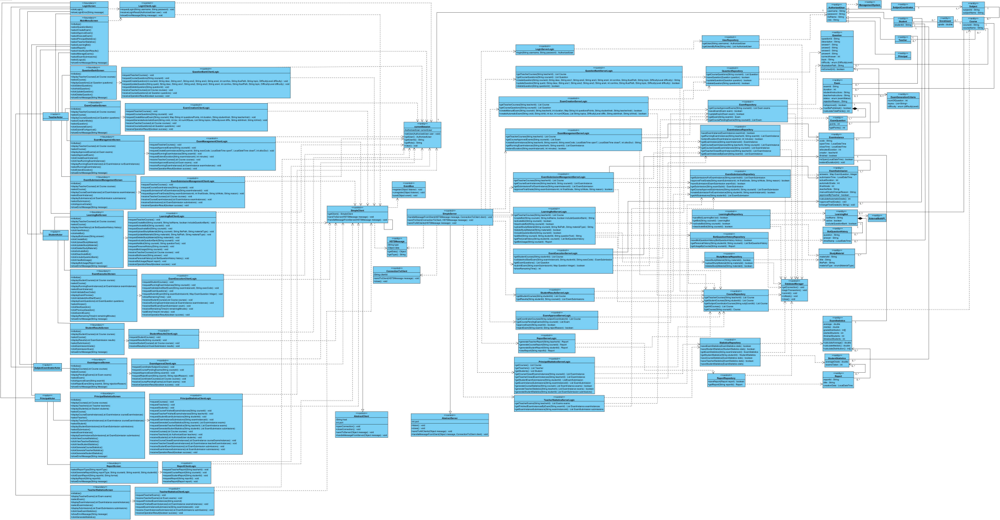

# HSTS - Client-Server Examination Management System

HSTS is a distributed desktop application for managing an academic examination workflow. The implemented system supports students, teachers, and subject coordinators across question management, exam creation and approval, scheduling, timed execution, grading, results, and teacher statistics.

The broader design phase also considered principal-facing reporting. That scope remains visible in parts of the UML documentation but is not included in the final application code.

## Project period

**April 2026 - August 2026**

This period covers requirements analysis, UML and system design, implementation, integration, and end-to-end testing - not only the dates represented by coding commits.

## Key features

- Role-based login and server-side authorization for students, teachers, and subject coordinators
- Duplicate-login prevention with authenticated sessions associated with active client connections
- Teacher question-bank operations: list, create, update, and delete course questions
- Exam creation from course questions with server-side validation of identifiers, ownership, points, and totals
- Subject-coordinator approval and rejection before an exam can be scheduled
- Scheduling with opening and closing windows, execution codes, and teacher-controlled duration extensions
- Timed student execution with server-authoritative deadlines, timeout handling, and safe submission when closing the client
- Automatic multiple-choice scoring followed by teacher review, final-grade approval, comments, and documented grade changes
- Student access to approved personal results and per-question feedback
- Per-instance teacher statistics including participation, completion status, average, median, and grade distribution
- Protection against duplicate attempts, duplicate submissions, stale approval actions, and conflicting grading approval
- Multi-client operation over TCP, tested with clients running on separate computers on the same local network

## Architecture

```text
JavaFX / FXML boundary
          |
          v
Client logic and client-side state
          |
          v
OCSF-style TCP client
          |
          v
OCSF-style TCP server and request routing
          |
          v
Server business logic and validation
          |
          v
Repository layer / Hibernate
          |
          v
MySQL
```

- **JavaFX boundary:** FXML views and screen controllers collect input, render results, and manage navigation.
- **Client logic:** creates typed request messages and sends them through a shared client connection.
- **Client event delivery:** Greenrobot EventBus delivers asynchronous server responses to the active JavaFX controllers.
- **Networking:** serializable `HSTSMessage`, request, and View/DTO objects are exchanged over an OCSF-style TCP connection.
- **Server routing:** `SimpleServer` obtains the authenticated session associated with the connection and delegates each request to the appropriate domain service.
- **Business logic:** server-side services enforce role, ownership, lifecycle, timing, and input rules. The server is authoritative for sensitive decisions.
- **Persistence:** repositories isolate Hibernate sessions, HQL queries, and database transactions from the rest of the application.

The client receives dedicated serializable View/DTO objects rather than direct access to the persistence layer.

## Technologies

- Java 25
- JavaFX 25 and FXML
- OCSF-style client-server networking over TCP
- Hibernate 5.6 / JPA 2.2
- MySQL 8 connector and MySQL 8 dialect
- Greenrobot EventBus 3.2
- Maven multi-module build
- Git and GitHub

## Selected design documentation

The diagrams document the system-design phase. Some planned elements were refined or reduced during implementation; the source code is authoritative for the final feature set.

### System class diagram

[](docs/design/hsts-class-diagram.pdf)

A broad BCE-style view of client boundaries, controls, server services, repositories, and domain entities. The preview is intentionally scaled down because the full diagram is very large; select it to open the full PDF.

| Diagram | Description |
| --- | --- |
| [System class diagram](docs/design/hsts-class-diagram.pdf) | BCE-style structure spanning client boundaries, controls, server services, repositories, and entities. |
| [Exam-creation sequence](docs/design/exam-creation-sequence.pdf) | Request flow from the teacher-facing screen through networking, business logic, repositories, and MySQL. The automatic-generation alternative shown in the design was not retained. |
| [Student grade-viewing sequence](docs/design/watch-grades-sequence.pdf) | Retrieval of a student's courses and approved examination results through the layered client-server stack. |

See [the design documentation index](docs/design/README.md) for direct links and implementation notes.

## Running the project

### Requirements

- JDK 25
- Apache Maven
- MySQL 8

The packaged JavaFX client currently targets Windows, matching the environment used for development and multi-computer testing.

### 1. Initialize MySQL

Start MySQL, then execute these scripts in order using MySQL Workbench or the MySQL CLI:

1. `server/src/main/resources/db/schema.sql`
2. `server/src/main/resources/db/seed.sql`

The schema script creates the `hsts` database and its tables. The seed script adds synthetic demonstration users, courses, enrollments, and questions. It intentionally does not seed exams, exam instances, or submissions so those records can be created through the application workflow.

### 2. Configure database access

The server accepts these environment variables:

| Variable | Purpose | Default |
| --- | --- | --- |
| `HSTS_DB_URL` | JDBC connection URL | `jdbc:mysql://localhost:3306/hsts` |
| `HSTS_DB_USERNAME` | MySQL username | `root` |
| `HSTS_DB_PASSWORD` | MySQL password | blank |

Do not commit a real database password. The `distribution` Maven profile packages a blank Hibernate password and expects credentials at runtime.

### 3. Build all modules

From the repository root:

```powershell
mvn clean package -Pdistribution -DskipTests
```

The build produces:

```text
client/target/HSTS-Client.jar
server/target/HSTS-Server.jar
```

### 4. Start the server

In PowerShell:

```powershell
$env:HSTS_DB_PASSWORD = "your-local-mysql-password"
java -jar "server\target\HSTS-Server.jar"
```

Set `HSTS_DB_URL` and `HSTS_DB_USERNAME` first if the defaults do not match the local MySQL installation. The server listens on TCP port `3000`.

### 5. Start one or more clients

For a client on the server computer:

```powershell
java -jar "client\target\HSTS-Client.jar"
```

For a client on another computer on the same network, copy `HSTS-Client.jar`, ensure TCP port `3000` is reachable through the server computer's firewall, and run:

```powershell
$env:HSTS_SERVER_HOST = "192.0.2.10" # replace with the server computer's LAN address
java -jar ".\HSTS-Client.jar"
```

The seed file contains synthetic demonstration accounts for each implemented role. These are development-only records and must not be reused as real credentials.

## Academic project note

HSTS was developed as a university Software Engineering project. Its requirements and UML design phase involved collaborative academic work, and the application integrates the course-provided OCSF networking foundation.

## Current scope and limitations

- This is an academic desktop application, not a production deployment.
- It requires a reachable MySQL installation and environment-specific database configuration.
- Networking uses serialized objects over plain TCP without production-grade transport encryption.
- Demonstration credentials are stored in plain text because password hashing was outside the implemented academic scope.
- The repository currently has no automated test suite; verification was performed through builds, database inspection, end-to-end workflows, simultaneous clients, and two-computer testing.
- Concurrent question edits use a last-write-wins policy; final approval and grading actions include additional state checks.
- Principal dashboards, generalized reporting, and automatic exam generation appear in parts of the design documentation but were not retained in the final implementation.
